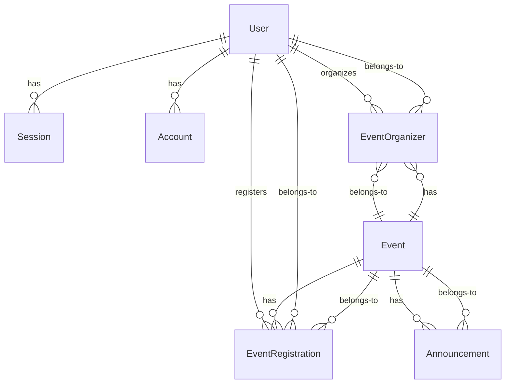

The DragonHacks platform uses **Prisma** as the ORM with **SQLite** database (can be switched to PostgreSQL for production).

## Configuration

```prisma prisma/schema.prisma:4
generator client {
  provider     = "prisma-client"
  output       = "../src/@generated/prisma"
  moduleFormat = "cjs"
}

datasource db {
  provider = "sqlite"
}
```

## User & Authentication Models

### User

Stores user profile information.

```prisma prisma/schema.prisma:15
model User {
  id                  String    @id
  name                String
  email               String
  emailVerified       Boolean   @default(false)
  image               String?
  createdAt           DateTime  @default(now())
  updatedAt           DateTime  @updatedAt
  phoneNumber         String?
  phoneNumberVerified Boolean?
  birthday            DateTime?
  sessions            Session[]
  accounts            Account[]
  
  eventOrganizers     EventOrganizer[]
  eventRegistrations  EventRegistration[]
  
  @@unique([email])
  @@unique([phoneNumber])
  @@map("user")
}
```

**Fields:**
- `id` - Unique user identifier
- `name` - Full name
- `email` - Email address (unique)
- `emailVerified` - Email verification status
- `image` - Profile picture URL
- `phoneNumber` - Phone number (unique, optional)
- `phoneNumberVerified` - Phone verification status
- `birthday` - Date of birth

**Relations:**
- `sessions` - User's active sessions
- `accounts` - OAuth accounts linked
- `eventOrganizers` - Events user organizes
- `eventRegistrations` - Events user registered for

### Session

Stores user session data for Better Auth.

```prisma prisma/schema.prisma:37
model Session {
  id        String   @id
  expiresAt DateTime
  token     String
  createdAt DateTime @default(now())
  updatedAt DateTime @updatedAt
  ipAddress String?
  userAgent String?
  userId    String
  user      User     @relation(fields: [userId], references: [id], onDelete: Cascade)
  
  @@unique([token])
  @@index([userId])
  @@map("session")
}
```

**Fields:**
- `id` - Session ID
- `token` - Session token (unique)
- `expiresAt` - Expiration timestamp
- `ipAddress` - Client IP
- `userAgent` - Browser info

**Relations:**
- `user` - Session owner (cascade delete)

### Account

Stores OAuth provider accounts.

```prisma prisma/schema.prisma:53
model Account {
  id                    String    @id
  accountId             String
  providerId            String
  userId                String
  user                  User      @relation(fields: [userId], references: [id], onDelete: Cascade)
  accessToken           String?
  refreshToken          String?
  idToken               String?
  accessTokenExpiresAt  DateTime?
  refreshTokenExpiresAt DateTime?
  scope                 String?
  password              String?
  createdAt             DateTime  @default(now())
  updatedAt             DateTime  @updatedAt
  
  @@index([userId])
  @@map("account")
}
```

**Fields:**
- `accountId` - Provider account ID
- `providerId` - OAuth provider (google, github, etc.)
- `accessToken` - OAuth access token
- `refreshToken` - OAuth refresh token
- `password` - Hashed password (for email/password auth)

### Verification

Stores email/phone verification codes.

```prisma prisma/schema.prisma:73
model Verification {
  id         String   @id
  identifier String
  value      String
  expiresAt  DateTime
  createdAt  DateTime @default(now())
  updatedAt  DateTime @updatedAt
  
  @@index([identifier])
  @@map("verification")
}
```

**Fields:**
- `identifier` - Email or phone number
- `value` - Verification code
- `expiresAt` - Code expiration

## Event Models

### Event

Core event information.

```prisma prisma/schema.prisma:119
model Event {
  id        String   @id @default(cuid())
  name      String
  slug      String? @unique
  description String?
  
  startAt DateTime
  endAt   DateTime
  
  bannerMediaKey String?
  
  locationUrl  String
  locationType  EventLocationType
  
  requireApproval Boolean @default(false)
  capacity  Int
  visibility EventVisibility
  
  category EventCategory
  type EventType
  createdAt DateTime @default(now())
  
  eventOrganizers EventOrganizer[]
  eventRegistration EventRegistration[]
  announcements Announcement[]
  
  @@index([createdAt])
}
```

**Fields:**
- `id` - Event ID (CUID)
- `name` - Event name
- `slug` - URL-friendly slug (unique)
- `description` - Event description
- `startAt` - Start date/time
- `endAt` - End date/time
- `bannerMediaKey` - S3 key for banner image
- `locationUrl` - Event location/meeting URL
- `locationType` - ONLINE or OFFLINE
- `requireApproval` - Requires organizer approval
- `capacity` - Max attendees
- `visibility` - PUBLIC or PRIVATE
- `category` - Event category (see enums)
- `type` - Event type (see enums)

**Relations:**
- `eventOrganizers` - Event organizers
- `eventRegistration` - Registered users
- `announcements` - Event announcements

### EventOrganizer

Links users to events they organize.

```prisma prisma/schema.prisma:149
model EventOrganizer {
  id        String   @id @default(uuid())
  
  eventId String
  event Event @relation(fields: [eventId], references: [id], onDelete: Cascade)
  
  userId String
  user User @relation(fields: [userId], references: [id], onDelete: Cascade)
  
  createdAt DateTime @default(now())
  
  @@unique([eventId, userId])
}
```

**Constraints:**
- Unique combination of `eventId` and `userId`
- Cascade delete when event or user deleted

### EventRegistration

Tracks event registrations and attendance.

```prisma prisma/schema.prisma:163
model EventRegistration {
  id        String   @id @default(uuid())
  
  eventId String
  event Event @relation(fields: [eventId], references: [id], onDelete: Cascade)
  
  userId  String
  user User @relation(fields: [userId], references: [id], onDelete: Cascade)
  
  status RegistrationStatus @default(APPROVED)
  checkedInAt DateTime?
  
  createdAt DateTime @default(now())
  
  @@unique([eventId, userId])
  @@index([eventId, status])
}
```

**Fields:**
- `status` - Registration status (PENDING, APPROVED, REJECTED, WAITLIST)
- `checkedInAt` - Check-in timestamp (null if not checked in)

**Constraints:**
- Unique combination of `eventId` and `userId`
- Indexed by `eventId` and `status` for efficient queries

### Announcement

Event announcements sent to attendees.

```prisma prisma/schema.prisma:181
model Announcement {
  id        String   @id @default(cuid())
  
  eventId String
  event   Event @relation(fields: [eventId], references: [id], onDelete: Cascade)
  
  title   String
  content String
  
  createdAt DateTime @default(now())
  
  @@index([eventId])
}
```

**Fields:**
- `title` - Announcement title
- `content` - Announcement body

## Enums

### EventType

```prisma prisma/schema.prisma:85
enum EventType {
  SEMINAR
  WORKSHOP
  COMPETITION
  BOOTCAMP
}
```

### EventLocationType

```prisma prisma/schema.prisma:92
enum EventLocationType {
  ONLINE
  OFFLINE
}
```

### EventCategory

```prisma prisma/schema.prisma:97
enum EventCategory {
  TECH
  SCIENCE
  MATH
  BIOLOGY
  SPORTS
  SOCIAL_SCIENCE
  OTHER
}
```

### EventVisibility

```prisma prisma/schema.prisma:107
enum EventVisibility {
  PUBLIC
  PRIVATE
}
```

### RegistrationStatus

```prisma prisma/schema.prisma:112
enum RegistrationStatus {
  PENDING
  APPROVED
  REJECTED
  WAITLIST
}
```

## Relationships Diagram



## Prisma Client Usage

### Query Examples

<CodeGroup>

```typescript Find User
const user = await prisma.user.findUnique({
  where: { id: 'user-id' },
  include: {
    eventOrganizers: true,
    eventRegistrations: true,
  },
});
```

```typescript Create Event
const event = await prisma.event.create({
  data: {
    name: 'DragonHacks 2026',
    description: 'Annual hackathon',
    startAt: new Date('2026-05-01'),
    endAt: new Date('2026-05-03'),
    locationUrl: 'https://zoom.us/...',
    locationType: 'ONLINE',
    capacity: 100,
    visibility: 'PUBLIC',
    category: 'TECH',
    type: 'COMPETITION',
    eventOrganizers: {
      create: {
        userId: 'organizer-id',
      },
    },
  },
});
```

```typescript Register for Event
const registration = await prisma.eventRegistration.create({
  data: {
    eventId: 'event-id',
    userId: 'user-id',
    status: 'APPROVED',
  },
});
```

```typescript Check In Attendee
const registration = await prisma.eventRegistration.update({
  where: {
    eventId_userId: {
      eventId: 'event-id',
      userId: 'user-id',
    },
  },
  data: {
    checkedInAt: new Date(),
  },
});
```

```typescript Get Event with Relations
const event = await prisma.event.findUnique({
  where: { id: 'event-id' },
  include: {
    eventOrganizers: {
      include: {
        user: {
          select: {
            id: true,
            name: true,
            image: true,
          },
        },
      },
    },
    eventRegistration: {
      where: { status: 'APPROVED' },
      include: {
        user: {
          select: {
            id: true,
            name: true,
            image: true,
          },
        },
      },
    },
    announcements: {
      orderBy: { createdAt: 'desc' },
    },
  },
});
```

</CodeGroup>

## Migrations

### Create Migration

```bash
pnpm prisma migrate dev --name add_event_slug
```

### Run Migrations

```bash
pnpm prisma migrate deploy
```

### Reset Database

```bash
pnpm prisma migrate reset
```

### Generate Client

```bash
pnpm prisma generate
```

The generated client is located at `src/@generated/prisma/`.

## Database Seeding

Create a seed file:

```typescript prisma/seed.ts
import { PrismaClient } from '../src/@generated/prisma/client';

const prisma = new PrismaClient();

async function main() {
  const user = await prisma.user.create({
    data: {
      id: 'seed-user-1',
      name: 'Admin User',
      email: 'admin@dragonhacks.io',
      emailVerified: true,
    },
  });
  
  const event = await prisma.event.create({
    data: {
      name: 'DragonHacks 2026',
      startAt: new Date('2026-05-01'),
      endAt: new Date('2026-05-03'),
      locationUrl: 'https://example.com',
      locationType: 'ONLINE',
      capacity: 100,
      visibility: 'PUBLIC',
      category: 'TECH',
      type: 'COMPETITION',
      eventOrganizers: {
        create: { userId: user.id },
      },
    },
  });
  
  console.log({ user, event });
}

main()
  .catch((e) => {
    console.error(e);
    process.exit(1);
  })
  .finally(async () => {
    await prisma.$disconnect();
  });
```

Run seed:

```bash
pnpm prisma db seed
```

## Best Practices

<CardGroup cols={2}>
  <Card title="Use transactions" icon="lock">
    Wrap related operations in transactions for data consistency.
    
    ```typescript
    await prisma.$transaction(async (tx) => {
      await tx.event.create({ data: eventData });
      await tx.eventOrganizer.create({ data: organizerData });
    });
    ```
  </Card>
  
  <Card title="Select only needed fields" icon="filter">
    Use `select` to reduce data transfer.
    
    ```typescript
    await prisma.user.findMany({
      select: { id: true, name: true },
    });
    ```
  </Card>
  
  <Card title="Use indexes" icon="magnifying-glass">
    Add indexes for frequently queried fields.
    
    ```prisma
    @@index([eventId, status])
    ```
  </Card>
  
  <Card title="Handle cascades carefully" icon="triangle-exclamation">
    Understand cascade delete behavior to avoid data loss.
    
    ```prisma
    onDelete: Cascade
    ```
  </Card>
</CardGroup>