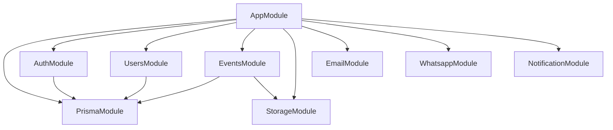

The DragonHacks backend is organized into feature modules. Each module handles a specific domain.

## Core Modules

### Prisma Module

Provides database connection and Prisma client.

**Location:** `src/prisma/`

**Exports:**
- `PrismaService` - Prisma client instance

**Usage:**
```typescript
import { PrismaService } from 'src/prisma/prisma.service';

@Injectable()
export class YourService {
  constructor(private prisma: PrismaService) {}
  
  async findUser(id: string) {
    return this.prisma.user.findUnique({ where: { id } });
  }
}
```

### Auth Module

Handles authentication using Better Auth.

**Location:** `src/auth/`

**Features:**
- Email/password authentication
- OAuth providers (Google, GitHub, etc.)
- Session management
- Email verification
- Password reset

**Key Files:**
- `auth.ts` - Better Auth configuration
- `auth.controller.ts` - Auth endpoints
- `auth.service.ts` - Auth business logic

**Example:**
```typescript
import { auth } from 'src/auth/auth';

const session = await auth.api.getSession({
  headers: request.headers,
});
```

## Feature Modules

### Users Module

Manages user profiles and data.

**Location:** `src/users/`

**Endpoints:**
- `GET /users/{id}` - Get user by ID
- `GET /users/me` - Get current user profile

**Contract:** `src/users/users.contract.ts:4`

**Service Methods:**
```typescript
class UsersService {
  async getById(id: string): Promise<User | null>
}
```

### Events Module

Manages events, registrations, organizers, and announcements.

**Location:** `src/events/`

**Endpoints:**
- `GET /events` - List all events with filters
- `GET /events/{id}` - Get event details
- `POST /events` - Create new event
- `PUT /events/{id}` - Update event
- `DELETE /events` - Delete event
- `POST /events/banner-upload-url` - Get S3 upload URL

**Sub-modules:**
- **Registrations** (`src/events/registrations/`)
- **Organizers** (`src/events/organizers/`)
- **Announcements** (`src/events/announcements/`)

**Service Methods:**
```typescript src/events/events.service.ts:32
class EventsService {
  async getById(id: string, currentUserId?: string)
  async getAll(params: FilterParams)
  async create(userId: string, input: CreateEventInput)
  async updateById(id: string, userId: string, input: UpdateEventInput)
  async deleteById(id: string, userId: string)
}
```

#### Registrations Sub-module

**Endpoints:**
- `POST /events/{eventId}/registrations` - Register for event
- `DELETE /events/{eventId}/registrations` - Unregister from event
- `GET /events/{eventId}/registrations` - Get all registrations
- `POST /events/{eventId}/registrations/{id}/approve` - Approve registration
- `POST /events/{eventId}/registrations/{id}/reject` - Reject registration
- `POST /events/{eventId}/registrations/{id}/attandance` - Check-in attendee
- `DELETE /events/{eventId}/registrations/{id}/attandance` - Remove check-in

**Contract:** `src/events/registrations/registrations.contract.ts:10`

#### Organizers Sub-module

**Endpoints:**
- `POST /events/{eventId}/organizers` - Add organizer
- `DELETE /events/{eventId}/organizers/{userId}` - Remove organizer

**Contract:** `src/events/organizers/organizers.contract.ts:4`

#### Announcements Sub-module

**Endpoints:**
- `POST /events/{eventId}/announcements` - Create announcement
- `GET /events/{eventId}/announcements` - Get announcements

**Contract:** `src/events/announcements/announcements.contract.ts:4`

### Storage Module

Handles file uploads to AWS S3.

**Location:** `src/storage/`

**Features:**
- Presigned upload URLs
- Presigned download URLs
- File deletion

**Service Methods:**
```typescript
class StorageService {
  async getPresignedUploadUrl(params: { key: string }): Promise<string>
  async getPresignedDownloadUrl(params: { key: string }): Promise<string>
  async deleteObject(params: { key: string }): Promise<void>
}
```

**Configuration:**
```env
AWS_ACCESS_KEY_ID=your-key
AWS_SECRET_ACCESS_KEY=your-secret
AWS_REGION=us-east-1
S3_BUCKET_NAME=dragonhacks-uploads
```

### Email Module

Sends transactional emails.

**Location:** `src/email/`

**Features:**
- Welcome emails
- Password reset emails
- Event notifications
- Custom templates

**Service Methods:**
```typescript
class EmailService {
  async sendWelcomeEmail(to: string, name: string)
  async sendPasswordReset(to: string, resetLink: string)
  async sendEventNotification(to: string, event: Event)
}
```

### WhatsApp Module

Sends WhatsApp messages for notifications.

**Location:** `src/whatsapp/`

**Features:**
- Event reminders
- Registration confirmations
- Announcement broadcasts

**Service Methods:**
```typescript
class WhatsappService {
  async sendMessage(to: string, message: string)
  async sendEventReminder(to: string, event: Event)
}
```

### Notification Module

Manages push notifications.

**Location:** `src/notification/`

**Features:**
- Browser push notifications
- Mobile push notifications
- Notification preferences

**Service Methods:**
```typescript
class NotificationService {
  async sendPushNotification(userId: string, notification: {
    title: string;
    body: string;
    data?: Record<string, any>;
  })
}
```

## Development Modules

### Reference Module

Provides API reference documentation (development only).

**Location:** `src/reference/`

**Features:**
- Auto-generated API docs
- Interactive playground
- Schema explorer

**Enabled only when:**
```typescript
process.env.NODE_ENV === 'development'
```

## Module Import Pattern

All feature modules follow this pattern:

```typescript
import { Module } from '@nestjs/common';
import { PrismaModule } from 'src/prisma/prisma.module';
import { YourService } from './your.service';
import { YourController } from './your.controller';

@Module({
  imports: [PrismaModule],        // Import dependencies
  providers: [YourService],        // Injectable services
  controllers: [YourController],   // oRPC controllers
  exports: [YourService],          // Export for other modules
})
export class YourModule {}
```

## Cross-Module Dependencies

### Common Dependencies

Most modules depend on:
- **PrismaModule** - Database access
- **ConfigModule** - Environment variables (global)

### Module Dependency Graph



## Queue Processing

Some modules use BullMQ for background jobs:

```typescript
import { InjectQueue } from '@nestjs/bullmq';
import { Queue } from 'bullmq';

@Injectable()
export class EmailService {
  constructor(
    @InjectQueue('email') private emailQueue: Queue,
  ) {}
  
  async sendWelcomeEmail(to: string, name: string) {
    await this.emailQueue.add('welcome', { to, name });
  }
}
```

**Queue Configuration:**
```typescript src/app.module.ts:63
BullModule.forRootAsync({
  useFactory: () => ({
    connection: {
      host: process.env.REDIS_HOST,
      port: parseInt(process.env.REDIS_PORT!),
    },
  }),
})
```

## Adding New Modules

1. **Create module directory:**
   ```bash
   mkdir src/your-feature
   ```

2. **Generate files:**
   ```bash
   nest g module your-feature
   nest g service your-feature
   nest g controller your-feature
   ```

3. **Define contract:**
   ```typescript src/your-feature/your-feature.contract.ts
   import { oc } from '@orpc/contract';
   
   export const yourFeatureContract = {
     getAll: oc.route({ path: '/your-feature', method: 'GET' }),
   };
   ```

4. **Add to main contract:**
   ```typescript src/contract.ts
   import { yourFeatureContract } from './your-feature/your-feature.contract';
   
   export const contract = {
     users: usersContract,
     events: eventsContract,
     yourFeature: yourFeatureContract,
   };
   ```

5. **Import in AppModule:**
   ```typescript src/app.module.ts
   import { YourFeatureModule } from './your-feature/your-feature.module';
   
   @Module({
     imports: [
       // ...
       YourFeatureModule,
     ],
   })
   export class AppModule {}
   ```